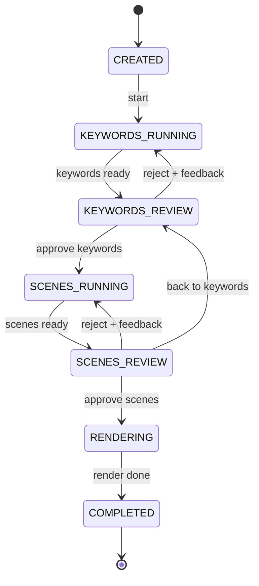

<div align="center">

# HITL Shorts Pipeline

**Make faceless short videos with an AI doing the legwork and you making the calls.**

Keyword research → *you approve* → script, voice and scenes → *you approve* → final render

`Python 3.11` · `Docker` · `Runs locally` · `Bring your own APIs`

</div>

---

## What it does

Most video generators run start to finish and hand you whatever comes out. This one **stops twice
and asks you first**, so bad keywords or a weak script never reach the render.

| Step | Who works | What happens |
|:---:|---|---|
| 1 | Machine | Analyzes your topic and proposes ranked keywords |
| **Gate 1** | **You** | Approve, add, or reject keywords (rejections come with notes the next run uses) |
| 2 | Machine | [MoneyPrinterTurbo](https://github.com/harry0703/MoneyPrinterTurbo) writes the script and builds scenes from **approved keywords only** |
| **Gate 2** | **You** | Reorder scenes, edit narration, swap clips, approve |
| 3 | Machine | Renders the video using **your exact scene order** |

## The flow



Any running step can move to **FAILED** and be retried from the same step. Any unfinished job can be
**CANCELLED**. State is saved to disk after every change, so a restart picks up where it stopped.

---

## Quick start

You need Docker (with Compose), Git and Python 3.11+.

```bash
# 0. Get the code (MoneyPrinterTurbo comes along as a submodule)
git clone --recurse-submodules <this repo's URL>
cd hitl-shorts-pipeline

# 1. Add your keys (only fill in the ones you plan to use)
cp .env.example .env

# 2. Choose your providers by naming presets (see "Choosing your APIs")
python scripts/apply_preset.py base llm-openai voice-elevenlabs

# 3. Start everything
docker compose up --build
```

The pipeline API is now at `http://localhost:8000` and MoneyPrinterTurbo at `http://localhost:8080`.
Both listen on your machine only.

**Try it without Docker or any keys** (uses the built-in manual keyword step):

```bash
pip install -e .
uvicorn --factory pipeline.api.app:app_factory --port 8000
curl -X POST localhost:8000/jobs -H 'content-type: application/json' \
     -d '{"subject": "cat facts", "providers": {"keywords": "manual"}}'
```

Then walk a video through both approval gates from the terminal:

```bash
python3 scripts/poc.py "3 surprising facts about octopuses"
```

Put your own footage in `library/clips/` (any `.mp4`, `.mov`, `.webm`, `.mkv`). Filenames that
contain a scene's keyword are matched first.

---

## Choosing your APIs

Providers are swapped with small preset files in `config/mpt-presets/`. Name the ones you want, and
later ones win:

| Preset | Gives you |
|---|---|
| `base` | Your own clips as the footage source (always include this first) |
| `llm-openai` · `llm-anthropic` · `llm-gemini` | Cloud model for scripts |
| `llm-ollama` | Local model on your machine, no API key |
| `voice-elevenlabs` | ElevenLabs narration |
| `stock-pexels-pixabay` | Optional stock footage keys |

```bash
python scripts/apply_preset.py base llm-anthropic voice-elevenlabs stock-pexels-pixabay
```

Keys come from `.env` and are written into `config/mpt-config.toml`, which is git-ignored.
The keyword step is configured separately in `config/pipeline.toml` and works with any
OpenAI-compatible URL, including Ollama. You can also choose stages per job:
`{"providers": {"keywords": "manual"}}`.

> The model names inside presets are placeholders. Edit them to the models you actually use.

---

## Using the API

Everything your UI needs is here. Each job response includes `allowed_events`, a list of the actions
that are legal right now, so buttons can enable and disable themselves.

| Action | Request |
|---|---|
| Create a job | `POST /jobs` `{subject, providers?}` |
| Start analysis | `POST /jobs/{id}/start` |
| **Gate 1** approve | `POST /jobs/{id}/keywords/review` `{approved_ids, extra_terms?}` |
| **Gate 1** reject | `POST /jobs/{id}/keywords/reject` `{feedback}` |
| Reorder or edit scenes | `PATCH /jobs/{id}/scenes` `{order?, edits?}` |
| **Gate 2** approve | `POST /jobs/{id}/scenes/approve` |
| **Gate 2** reject | `POST /jobs/{id}/scenes/reject` `{feedback}` |
| Go back a gate | `POST /jobs/{id}/back-to-keywords` |
| Retry or cancel | `POST /jobs/{id}/retry` · `POST /jobs/{id}/cancel` |
| Read | `GET /jobs` · `GET /jobs/{id}` · `GET /jobs/{id}/output` |

Illegal actions return `409` with the reason, bad input `422`, unknown job `404`.

---

## Project layout

```
hitl-shorts-pipeline/
├── pipeline/
│   ├── core/        The brain: state machine, job models, storage, orchestrator
│   ├── stages/      Swappable steps
│   │   ├── keywords/    manual.py, llm.py        <- add SEO providers here
│   │   ├── scenes/      mpt.py, clips.py         <- add clip sources here
│   │   └── render/      mpt.py
│   └── api/         HTTP API for your UI
├── config/          pipeline.toml, mpt-presets/
├── scripts/         apply_preset.py
├── library/clips/   Your footage goes here
├── data/jobs/       One folder per job (job.json + assets)
├── vendor/          MoneyPrinterTurbo (git submodule, pinned to a commit)
├── docs/            Background notes
└── tests/           46 tests
```

## Adding your own provider

Each step is one small class. Write it, register it in `pipeline/stages/registry.py`, and pick it
per job.

```python
class MySeoStage:                       # a keyword provider
    async def run(self, job, ctx) -> list[Keyword]:
        ...

registry.register_keywords("my-seo", lambda: MySeoStage())
```

The same pattern works for scene builders, renderers and clip sources (your scraper, Pexels, AI video).

## Tests

```bash
python -m unittest discover -s tests -t .
```

No network needed. They cover the state machine, both approval gates, failures and retries, the API,
and the MoneyPrinterTurbo calls (against a mock built from its source code).

---

## Status and known gaps

**Working and tested:** the state machine, orchestrator, API, provider presets, and the
MoneyPrinterTurbo request logic.

**Not run yet:** `docker compose up`, a real render, and live LLM or ElevenLabs calls.
Things to check on first run:

1. Clips must be at least 480 pixels on their shorter side, or MoneyPrinterTurbo skips them.
   (MoneyPrinterTurbo only reads local clips from `storage/local_videos`; `docker-compose.yml`
   already mounts `library/clips` there.)
2. Per-scene audio previews assume MoneyPrinterTurbo serves audio at `/tasks/<id>/audio.mp3`.
3. Only run one pipeline process per `data/` folder.

**Not built yet:** the review UI, Pexels/Pixabay/AI clip sources, and a real SEO data provider.

**About RankReel:** it is a countdown-video editor and, as far as its public pages show, has no
keyword or ranking-data features. The keyword step therefore uses an LLM (its volume and difficulty
numbers are estimates and are flagged as such) or a list you supply. See `docs/reference.md`.
