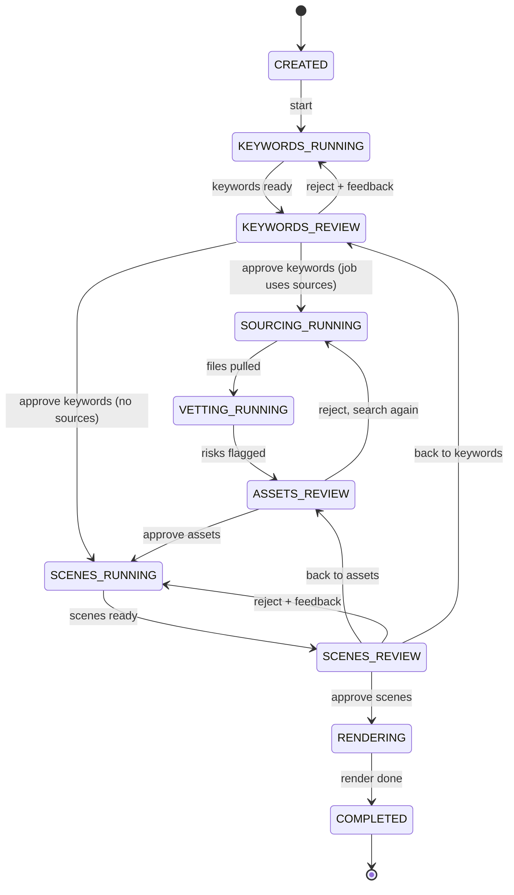

<div align="center">

# HITL Shorts Pipeline

**Make faceless short videos with an AI doing the legwork and you making the calls.**

Keyword research → *you approve* → script, voice and scenes → *you approve* → final render

`Python 3.11` · `Docker` · `Runs locally` · `Bring your own APIs`

</div>

---

## What it does

Most video generators run start to finish and hand you whatever comes out. This one **stops three
times and asks you first**, so bad keywords, risky images, or a weak script never reach the render.

| Step | Who works | What happens |
|:---:|---|---|
| 1 | Machine | Analyzes your topic and proposes ranked keywords |
| **Gate 1** | **You** | Approve, add, or reject keywords (rejections come with notes the next run uses) |
| 2 | Machine | Pulls text and images for those keywords from **Wikipedia, Wikimedia Commons, Pexels, Pixabay, Unsplash, NASA, Internet Archive, Library of Congress, Chronicling America, Smithsonian, Openverse, DPLA, Flickr, Europeana, your own list of URLs** (or your own scraper's folder). Pick any combination with `--sources`. Each source gets its own folder in the project, with a log of every request |
| 2b | Machine | **Vets** every file with plain, readable rules: license, people, sensitive content, size. It flags and explains. It never deletes anything |
| **Gate 2** | **You** | Approve or reject each asset, seeing the risk and *why* it was flagged. High-risk approvals need a written reason |
| 3 | Machine | [MoneyPrinterTurbo](https://github.com/harry0703/MoneyPrinterTurbo) writes the script (grounded in the Wikipedia text) and picks a clip per scene from **approved assets only** |
| **Gate 3** | **You** | Reorder scenes, edit narration, swap clips, approve |
| 4 | Machine | Renders using **your exact scene order** and writes `CREDITS.md` |

Every decision, by you, by an AI model, or by a rule, is written to the project's
`decisions.jsonl` and a readable `DECISIONS.md`. See [Where everything is saved](#where-everything-is-saved).

## The flow



Any running step can move to **FAILED** and be retried from the same step. Any unfinished job can be
**CANCELLED**. State is saved to disk after every change, so a restart picks up where it stopped.

---

## Quick start

You need Docker (with Compose), Git and Python 3.11+.

```bash
# 0. Get the code (MoneyPrinterTurbo comes along as a submodule)
git clone --recurse-submodules <this repo's URL>
cd hitl-shorts-pipeline

# 1. Add your keys (only fill in the ones you plan to use)
cp .env.example .env

# 2. Choose your providers by naming presets (see "Choosing your APIs")
python scripts/apply_preset.py base llm-openai voice-elevenlabs

# 3. Start everything
docker compose up --build
```

The pipeline API is now at `http://localhost:8000` and MoneyPrinterTurbo at `http://localhost:8080`.
Both listen on your machine only.

**Try it without Docker or any keys** (uses the built-in manual keyword step):

```bash
pip install -e .
uvicorn --factory pipeline.api.app:app_factory --port 8000
curl -X POST localhost:8000/jobs -H 'content-type: application/json' \
     -d '{"subject": "cat facts", "providers": {"keywords": "manual"}}'
```

Then walk a video through both approval gates from the terminal:

```bash
python3 scripts/poc.py "3 surprising facts about octopuses"
```

Put your own footage in `library/clips/` (any `.mp4`, `.mov`, `.webm`, `.mkv`). Filenames that
contain a scene's keyword are matched first.

---

## Choosing your APIs

Providers are swapped with small preset files in `config/mpt-presets/`. Name the ones you want, and
later ones win:

| Preset | Gives you |
|---|---|
| `base` | Your own clips as the footage source (always include this first) |
| `llm-openai` · `llm-anthropic` · `llm-gemini` | Cloud model for scripts |
| `llm-ollama` | Local model on your machine, no API key |
| `voice-elevenlabs` | ElevenLabs narration |
| `stock-pexels-pixabay` | Optional stock footage keys |

```bash
python scripts/apply_preset.py base llm-anthropic voice-elevenlabs stock-pexels-pixabay
```

Keys come from `.env` and are written into `config/mpt-config.toml`, which is git-ignored.
The keyword step is configured separately in `config/pipeline.toml` and works with any
OpenAI-compatible URL, including Ollama. You can also choose stages per job:
`{"providers": {"keywords": "manual"}}`.

> The model names inside presets are placeholders. Edit them to the models you actually use.

---

## Using the API

Everything your UI needs is here. Each job response includes `allowed_events`, a list of the actions
that are legal right now, so buttons can enable and disable themselves.

| Action | Request |
|---|---|
| Create a job | `POST /jobs` `{subject, providers?}` |
| Start analysis | `POST /jobs/{id}/start` |
| **Gate 1** approve | `POST /jobs/{id}/keywords/review` `{approved_ids, extra_terms?}` |
| **Gate 1** reject | `POST /jobs/{id}/keywords/reject` `{feedback}` |
| **Gate 2** decide per asset | `POST /jobs/{id}/assets/review` `{decisions: {asset_id: {decision, note}}, reviewer}` |
| **Gate 2** done | `POST /jobs/{id}/assets/approve` `{reviewer}` |
| **Gate 2** search again | `POST /jobs/{id}/assets/reject` `{feedback, extra_queries?, reviewer}` |
| Look at an asset | `GET /jobs/{id}/assets/{asset_id}/file` |
| Decision log | `GET /jobs/{id}/decisions` (`?format=md` for the readable one) |
| Reorder or edit scenes | `PATCH /jobs/{id}/scenes` `{order?, edits?}` |
| **Gate 3** approve | `POST /jobs/{id}/scenes/approve` |
| **Gate 3** reject | `POST /jobs/{id}/scenes/reject` `{feedback}` |
| Go back a gate | `POST /jobs/{id}/back-to-keywords` · `POST /jobs/{id}/back-to-assets` |
| Retry or cancel | `POST /jobs/{id}/retry` · `POST /jobs/{id}/cancel` |
| Read | `GET /jobs` · `GET /jobs/{id}` · `GET /jobs/{id}/output` |

Every human action accepts a `reviewer` name, which is written to the decision log. Asset decisions require one.
Illegal actions return `409` with the reason, bad input `422`, unknown job `404`.

---

## Project layout

```
hitl-shorts-pipeline/
├── pipeline/
│   ├── core/        The brain: state machine, models, storage, orchestrator, decision log
│   ├── sources/     Where data is pulled from: wikipedia.py, commons.py, pexels.py, pixabay.py, unsplash.py, nasa.py, internet_archive.py, loc.py, smithsonian.py, urls.py, folder.py
│   ├── vetting/     rules.py: the explainable risk rules
│   ├── stages/      Swappable steps
│   │   ├── keywords/    manual.py, llm.py        <- add SEO providers here
│   │   ├── scenes/      mpt.py, clips.py         <- add clip sources here
│   │   └── render/      mpt.py
│   └── api/         HTTP API for your UI
├── config/          pipeline.toml, mpt-presets/
├── scripts/         apply_preset.py
├── library/clips/   Your footage goes here
├── projects/        One folder per video (see below)
├── library/scraped/ Drop your own scraper's output here (the "folder" source)
├── vendor/          MoneyPrinterTurbo (git submodule, pinned to a commit)
├── docs/            Background notes
└── tests/           57 tests
```

## Where everything is saved

Each video is one folder. Each source you pull from gets its own sub-folder inside it:

```
projects/cute-cats-294eb679f060/
├── job.json              current state of the project
├── decisions.jsonl       every decision, append-only and hash-chained (tamper-evident)
├── DECISIONS.md          the same log, readable
├── SOURCES.md            every photo, clip and text pulled, with its link, license and status (updated as you go)
├── CREDITS.md            attribution for every approved asset (written at render)
├── sources/
│   ├── wikipedia/  requests.jsonl  manifest.json  files/   (article text)
│   ├── commons/    requests.jsonl  manifest.json  files/   (images)
│   └── pexels/     requests.jsonl  manifest.json  files/   (photos and video)
└── assets/               the rendered video
```

- `requests.jsonl`: every web request, with URL, purpose and result, so you can see exactly where data came from.
- `manifest.json`: every kept file with its source URL, license, author, hash, the machine's risk flags, and your decision.
- `decisions.jsonl`: who decided what, when, why, and by what logic. Actors are `human` (your name), `ai` (model recorded), or `machine` (a rule, with its version).

How risk is judged, rule by rule: [docs/VETTING.md](docs/VETTING.md). How relevance is scored: [docs/SCORING.md](docs/SCORING.md).
Checking whether a scoring method/version is actually any good: [docs/EVALUATION.md](docs/EVALUATION.md). Adding another scraping
source: [docs/ADD_A_SOURCE.md](docs/ADD_A_SOURCE.md). Trade-offs we chose on purpose and may improve: [docs/KNOWN_LIMITATIONS.md](docs/KNOWN_LIMITATIONS.md). Voices, models and sources to try, with results: [docs/OPTIONS_TO_TRY.md](docs/OPTIONS_TO_TRY.md).
Optional content niches (True Crime, Conspiracy, Science, Pet Product, Food/Bakery) that bias keyword phrasing and add a
per-asset aesthetic/relevance evaluation at Gate 2: [docs/NICHES.md](docs/NICHES.md).

## Adding your own provider

Each step is one small class. Write it, register it in `pipeline/stages/registry.py`, and pick it
per job.

```python
class MySeoStage:                       # a keyword provider
    async def run(self, job, ctx) -> list[Keyword]:
        ...

registry.register_keywords("my-seo", lambda: MySeoStage())
```

The same pattern works for scene builders, renderers and clip sources (your scraper, Pexels, AI video).

## Tests

```bash
python -m unittest discover -s tests -t .
```

No network needed. They cover the state machine, both approval gates, failures and retries, the API,
and the MoneyPrinterTurbo calls (against a mock built from its source code).

---

## Status and known gaps

**Working and tested:** the state machine, orchestrator, API, provider presets, and the
MoneyPrinterTurbo request logic.

**Not run yet:** `docker compose up`, a real render, and live LLM or ElevenLabs calls.
Things to check on first run:

1. Clips must be at least 480 pixels on their shorter side, or MoneyPrinterTurbo skips them.
   (MoneyPrinterTurbo only reads local clips from `storage/local_videos`; `docker-compose.yml`
   already mounts `library/clips` there.)
2. Per-scene audio previews assume MoneyPrinterTurbo serves audio at `/tasks/<id>/audio.mp3`.
3. Only run one pipeline process per `projects/` folder.

4. Wikipedia, Commons and Pexels were tested against hand-written mocks of their API responses, not the live sites. If a live response differs, the request log in `sources/<name>/requests.jsonl` shows what came back.
5. The renderer only handles jpg/png images and mp4/mov/webm video, at least 480 px. Other formats are skipped and logged.
6. The vetting rules read titles, descriptions and license text. They cannot see the picture itself. That is why a human stays in the loop.

**Not built yet:** the after-render editor, Pixabay/AI clip sources, and a real SEO data provider. (The asset and
scene/script review pages are built -- see [docs/REVIEW_UI.md](docs/REVIEW_UI.md).)

**About RankReel:** it is a countdown-video editor and, as far as its public pages show, has no
keyword or ranking-data features. The keyword step therefore uses an LLM (its volume and difficulty
numbers are estimates and are flagged as such) or a list you supply. See `docs/reference.md`.
